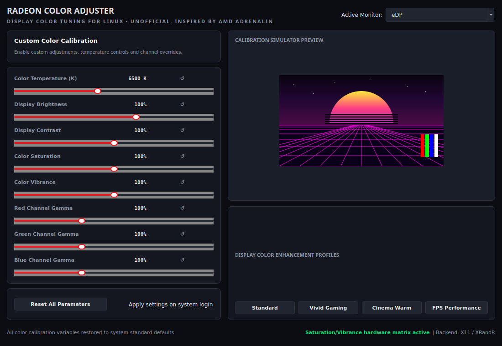

# Radeon Color Adjuster

> **Unofficial.** Not made by, affiliated with, or endorsed by AMD. "Radeon"
> and "Adrenalin" are AMD's names; the look is inspired by AMD Software:
> Adrenalin Edition, which isn't available on Linux.

Display colour tuning for Linux in an Adrenalin-style window: colour
temperature, brightness, contrast, saturation, vibrance and per-channel gamma,
set separately for each connected monitor and optionally re-applied at every
login. Built on a ThinkPad T495 (Radeon Vega 8, `amdgpu`) running Linux Mint
22.3 with Cinnamon on X11.



Contents: [1 Features](#1-features) · [2 Install](#2-install-and-run) ·
[3 How it works](#3-how-it-works) · [4 Files](#4-where-things-live) ·
[5 Limits](#5-known-limits) · [6 License](#6-license)

---

## 1. Features

| Control | Range | Default |
| --- | --- | --- |
| Colour temperature | 4000 K (warm amber) – 10000 K (cool blue) | 6500 K |
| Brightness | 20 – 150 % | 100 % |
| Contrast | 50 – 150 % | 100 % |
| Saturation | 0 – 200 % | 100 % |
| Vibrance | 0 – 200 % | 100 % |
| Red / green / blue gamma | 50 – 200 % each | 100 % |

* **Per-monitor settings**: pick the monitor (for example `eDP` or
  `DisplayPort-1`) at the top right. Each one keeps its own calibration.
* **Profiles** set all the sliders at once. *Standard* resets everything to
  the defaults. Saturation and vibrance only change where `CTM` is supported
  (see [3](#3-how-it-works)).

  | Profile | Temp | Brightness | Contrast | Saturation | Vibrance | R / G / B gamma |
  | --- | --- | --- | --- | --- | --- | --- |
  | Vivid Gaming | 6800 K | 105 % | 115 % | 125 % | 115 % | 115 / 115 / 125 % |
  | Cinema Warm | 5500 K | 90 % | 95 % | 95 % | 90 % | 100 / 105 / 85 % |
  | FPS Performance | 7200 K | 115 % | 120 % | 110 % | 120 % | 125 / 120 / 110 % |
* **Live preview**: a test scene redraws as you move the sliders.
* **Reset**: *Reset All Parameters*, or the ↺ next to any single slider.
* **Apply on login**: re-applies your saved calibration each time you log in,
  without opening the window.

## 2. Install and run

| Needs | Package on Mint / Ubuntu |
| --- | --- |
| An X11 session and `xrandr` | `x11-xserver-utils` |
| Python 3 with PyQt5 | `python3-pyqt5`, or a venv from `requirements.txt` |

```sh
git clone https://github.com/lestorrr/radeon-color-adjuster.git
cd radeon-color-adjuster
python3 -m venv venv && venv/bin/pip install -r requirements.txt   # or: sudo apt install python3-pyqt5
./launch.sh
```

`launch.sh` uses `./venv` when it exists and the system `python3` otherwise.
To re-apply the saved settings without the window (what the login entry
runs):

```sh
python3 main.py --apply
```

To add it to the app menu, save this as
`~/.local/share/applications/radeon-color-adjuster.desktop`, with `Exec`
pointing at your clone:

```ini
[Desktop Entry]
Type=Application
Name=Radeon Color Adjuster
Exec=/path/to/radeon-color-adjuster/launch.sh
Icon=video-display
Categories=Utility;Settings;
```

## 3. How it works

Everything goes through `xrandr` on the selected output:

| Setting | How it is applied |
| --- | --- |
| Brightness | `xrandr --output <monitor> --brightness <value>` |
| Colour temperature | Turned into red, green and blue gains, then folded into the gamma below |
| Gamma and contrast | `xrandr --output <monitor> --gamma R:G:B`, each channel = channel gamma × contrast ÷ temperature gain |
| Saturation and vibrance | A 3×3 colour matrix (BT.709 weights) written to the output's `CTM` property with `xrandr --set CTM …` |

The `CTM` (colour transformation matrix) property is provided by the GPU
driver; `amdgpu` exposes it on most outputs. The status bar shows whether it
was found. Without it, saturation and vibrance have no effect and everything
else still works.

**Opening the window applies the saved settings for the selected monitor
straight away**, and every slider change is applied and saved immediately.
With *Custom Color Calibration* turned off, the monitor is put back to
brightness 1.0, gamma 1:1:1 and an identity matrix.

If the screen ever ends up unreadable, this resets it (use your monitor's
name from `xrandr`):

```sh
xrandr --output eDP --brightness 1 --gamma 1:1:1
```

## 4. Where things live

| Path | What |
| --- | --- |
| `main.py` | The whole app: colour maths, `xrandr` calls, PyQt5 window, `--apply` mode |
| `launch.sh` | Starts `main.py` with `./venv` or the system Python |
| `requirements.txt` | PyQt5 for the venv |
| `~/.config/radeon_color_adjuster.json` | Your saved settings, one entry per monitor |
| `~/.config/autostart/radeon-color-adjuster.desktop` | Written only while *Apply settings on system login* is ticked |

## 5. Known limits

* **X11 only.** `xrandr` gamma and `CTM` don't work under Wayland.
* `xrandr` settings last until you log out, which is why the login option
  exists.
* Brightness here is a software adjustment of the picture, not the backlight.
  Below 100 % it dims the image; above 100 % it washes out highlights.
* Colour temperature is an approximation for comfort, not a measured
  calibration. Use a colorimeter and an ICC profile for colour-critical work.

## 6. License

MIT, see [LICENSE](LICENSE). © 2026 John Lester Liclican ·
[@lestorrr](https://github.com/lestorrr) · [jhnlstrlclcn.engineer](https://jhnlstrlclcn.engineer/)
